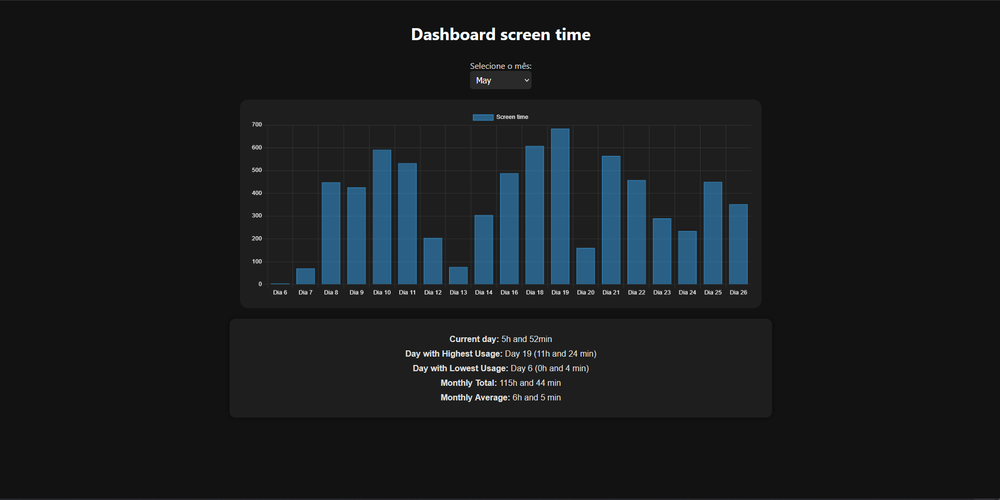

# ScreenTime

**ScreenTime** is a lightweight application that tracks how much time you spend in front of your screen and displays the data on a local web dashboard. The goal is to help you reflect on your digital habits and encourage a more productive daily routine.

##  Features

 Real-time screen time tracking
 Dashboard accessible via `localhost`
 Insights into your digital behavior
 Lightweight and runs in the background
 100% local – no external tracking

## Installation
### Windows
```bash
git clone https://github.com/S0FT-s/ScreenTime.git
cd screentime
python Setup.py
```
Then just do what the setup.py asks.
And its done

### Linux
Ensure that main.pyw and server.pyw runs automatically when the computer boots up.

## Showcase 

